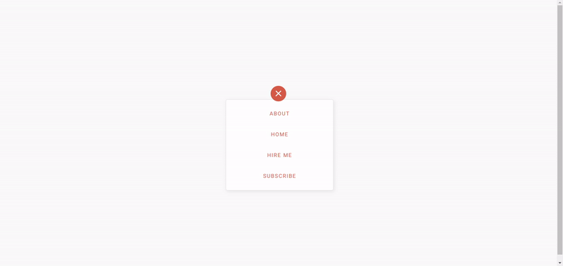
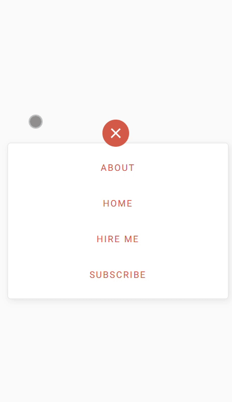
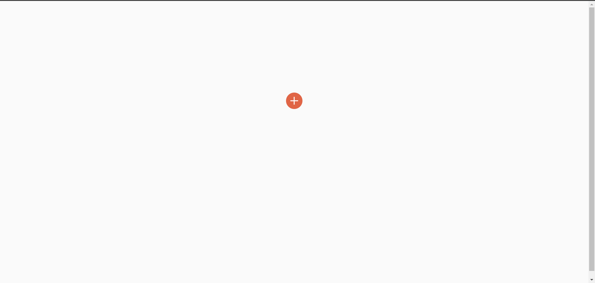
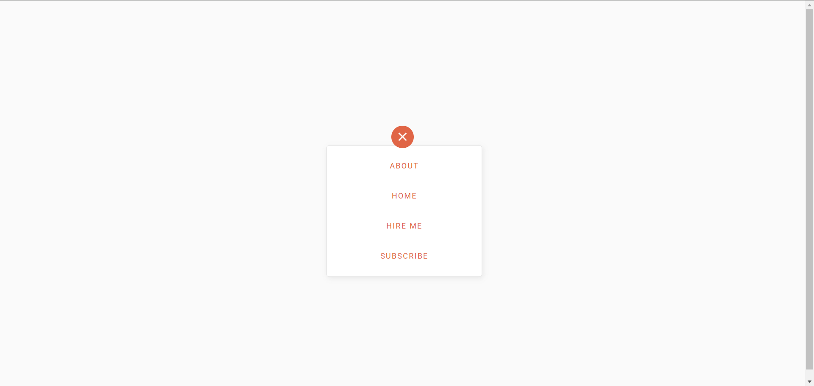

# Quick Action Button | Instant Access, Effortless Control

<a href="https://www.linkedin.com/in/dharmendraverma95/" target="_blank">LinkedIn Profile </a>

<a href="https://www.behance.net/dhirukumar" target="_blank">Behance Profile </a>

# Overview

The Quick Action Button is an interactive UI component that allows users to perform tasks or actions with a single tap. It’s designed to streamline the user experience, making apps more responsive and intuitive.

### Features
<ul>
  <li>Instant Access: Quickly trigger common actions.
</li>
  <li>Customizable: Easily modify the button style and functionality.</li>
  <li>Responsive: Works across different screen sizes and devices.</li>
</ul>

# Preview

 
Desktop Icon Button Desgin & Animation 
 

 
Mobile Icon Button Desgin & Animation
 

 
Icon Button Rest & Hover State
 

 
###### Lang
<ul>
  <li>Graphic Design Software: Photoshop, Figma (for mockups)</li>
  <li>Web Tools (Optional): HTML5, SCSS for any digital presentations or landing pages</li>
  <li>Font Awesome & Google Fonts  (Optional for icons )</li>

</ul>

